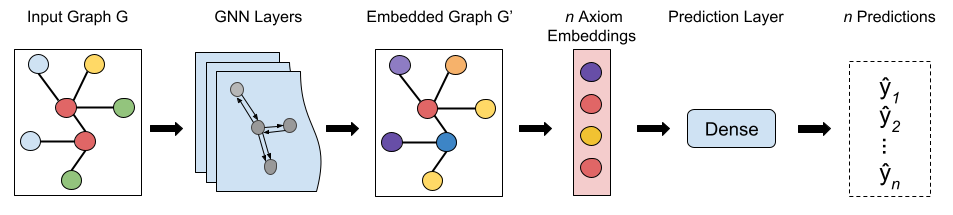
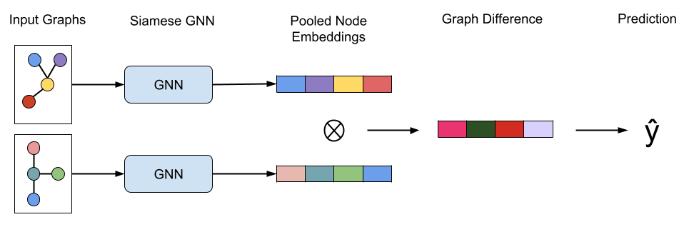

# Graph Neural Networks for First-order Formulae

This repo examines different graph encoding and GNN configurations for first-order reasoning.
It deals with finding good graph embeddings for a supervised binary premise selection task,
and a synthetic unsupervised graph matching task. The graph matching task consists of estimating
the Laplacian spectral distance of two graphs.

The main purposes are:
* Generate the unsupervised dataset of the proposed task
* Train and evaluate GNN and encoding configurations.
* Notebooks with EDA on the data + plotting
* Computing and extracting graph embeddings from a pre-trained model with three different pooling operations

There are two main training tasks: supervised training on the binary premise selection task:



and unsupervised learning of the Laplacian Spectrum distance between pairs of graphs:



# Installation

Scripts were made with Python 3.10.8.

``pip install -r requirements.txt``

## Parser

Managed to build the rust parser with
rustup default nightly-2021-03-24-x86_64-unknown-linux-gnu
source $HOME/.cargo/env
cargo  +nightly build 
cargo  build --release
cp target/release/libparser.so ./graph_parser.so

## Torch Troubleshooting

If running into issues with CUDA installation, one solution can be to run:

``export CUDA_VISIBLE_DEVICES=""``

# Datasets

The original DeepMath dataset is contained within `nndata.zip`.
The extended dataset used for evaluation is found in `merged_problems.zip`


# Experiments

Problem representation experiments for the thesis chapter, described briefly here.
It Consists of three main experiments over two tasks: premise selection and graph similarity.
Need to specify the model parameters in the respective `params.json` files.

## Experiment 1: Graph connectivity and GCN direction

Run attached script which explores GCN with separate and single conv layers over a directed and undirected graph, over both tasks.
The result is later generated by synthesise_results.py

``experiments/thesis/graph_direction/run.sh``

## Experiment 2: GCN Depth

Run attached script which explores various GCN depths with and without argument nodes over both tasks.
The results should be plotted by a notebook in `/notebooks`.

``/.experiments/thesis/graph_depth/run.sh``

## Experiment 3: Transfer Learning

Run attached script which explores how embeddings prevail through transfer learning.
It assumes that the models exists from previous experiments and can be changed for other results.

``experiments/thesis/transfer/run.sh``

# Compute embeddings

Run the script `extract_features.py` and set the input arguments to fit the desired requirements.
e.g. (assuming there is a pre-trained model in experiment/premise/test)

```python3 extract_features.py experiments/premise/test/ premise --id_file id_files/deepmath.txt --nodes conjecture```


# Generate Unsupervised Datasets

Run the script `generate_synthetic_dataset.py` and set the input arguments to fit the desired requirements.

# Authors
- [Edvard Holden](https://github.com/EdvardHolden)

